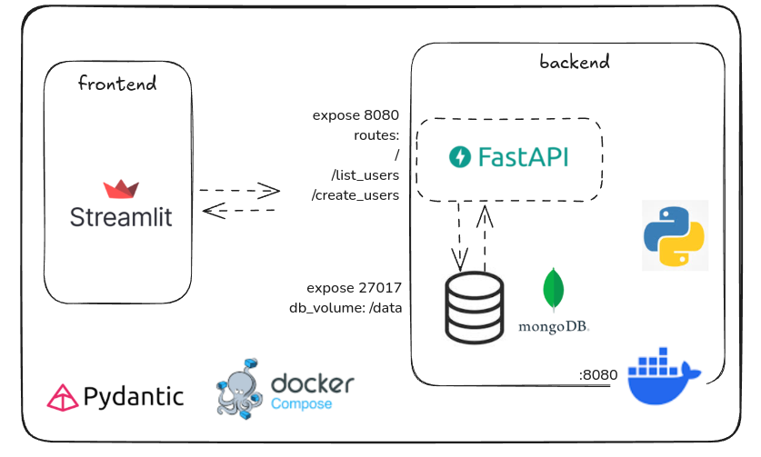

### Description

This project is a containerized web application designed for **user creation and listing**. It follows modern architectural practices by separating concerns into three distinct services:

- **Frontend:** Built with ***Streamlit***, offering a lightweight and rapid interface for user interaction.
    
- **Backend:** A RESTful API developed using FastAPI, responsible for handling business logic and communication with the database.
    
- **Database:** A MongoDB instance used to persist user data.

### Orchestration Features
The application is composed of **three Docker containers** orchestrated via **Docker Compose**:

1. **Streamlit** – for the user interface (registration and listing views).
    
2. **FastAPI** – for the REST API with user management endpoints.
    
3. **MongoDB** – for data persistence.
    
This setup demonstrates efficient containerization and service orchestration, enabling rapid deployment and scalability.

### Overview:

#### Listing users frontend:
#### Listing users backend:
#### Create users frontend:
#### Create users Backend:

### Author:
Itaira S. F. Santos

